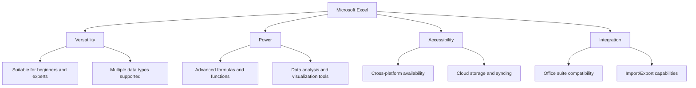
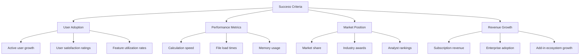
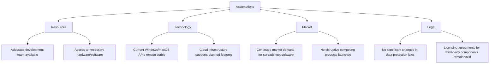
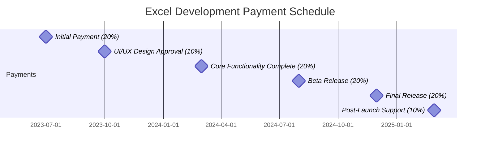
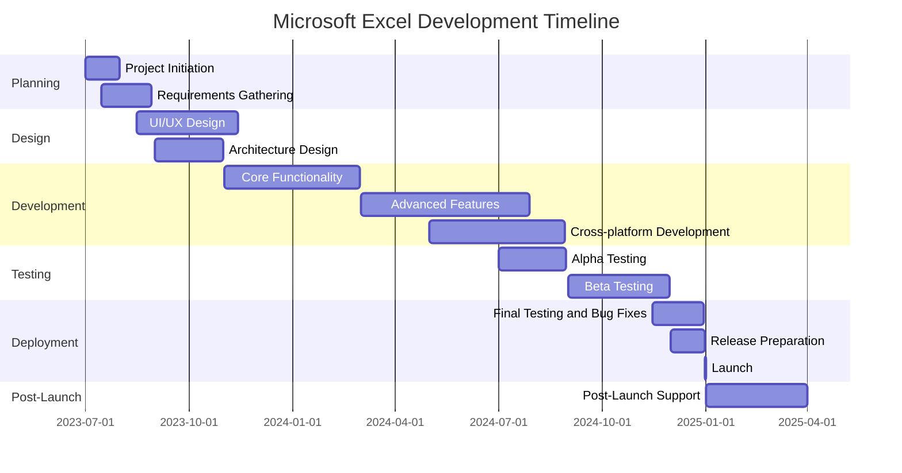
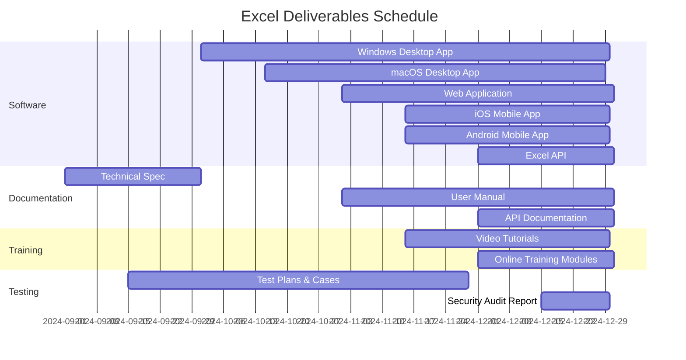

# EXECUTIVE SUMMARY

## PROJECT OVERVIEW

Microsoft Excel is a revolutionary spreadsheet software application designed to transform the way individuals and businesses organize, analyze, and visualize data. In response to the growing need for powerful yet user-friendly data management tools, Excel offers a comprehensive solution that combines intuitive design with advanced functionality. The software addresses the challenges of manual data handling, complex calculations, and limited data visualization options by providing a versatile platform that caters to both novice users and data professionals.

## OBJECTIVES

1. Create a user-friendly interface with a gridded system of cells for effortless data input and manipulation
2. Develop a robust formula system supporting complex calculations and data analysis
3. Implement advanced features including charting, pivot tables, and macros for in-depth data exploration
4. Ensure cross-platform compatibility (Windows, macOS, web, and mobile) with cloud integration
5. Design collaboration features to enable multiple users to work simultaneously on shared spreadsheets
6. Optimize performance to handle large datasets efficiently
7. Integrate seamlessly with other Office suite applications for a cohesive productivity ecosystem

## VALUE PROPOSITION

Microsoft Excel offers unparalleled value through its combination of versatility, power, accessibility, and integration:

1. Versatility: Excel caters to a wide range of users, from beginners to advanced data analysts, providing an adaptable tool for various industries and applications.

2. Power: With its comprehensive formula system, pivot tables, and macro capabilities, Excel empowers users to perform complex data analysis and automate tasks, increasing productivity and decision-making capabilities.

3. Accessibility: Cross-platform support and cloud integration ensure that users can access and work on their spreadsheets from any device, promoting flexibility and collaboration.

4. Integration: Seamless compatibility with other Office suite applications and the ability to import/export various data formats make Excel a central hub for data management and analysis within any organization's software ecosystem.

## PROJECT OBJECTIVES

### BUSINESS GOALS

1. Establish Microsoft Excel as the industry-leading spreadsheet application
2. Increase Microsoft Office suite adoption in both personal and enterprise markets
3. Enhance user productivity across various industries and job functions
4. Drive recurring revenue through subscription-based licensing models
5. Strengthen Microsoft's position in the cloud services market
6. Foster a robust ecosystem of third-party add-ins and integrations

### TECHNICAL GOALS

1. Develop a highly responsive and intuitive user interface
2. Implement a powerful and extensible formula engine
3. Create a scalable architecture to handle large datasets efficiently
4. Ensure cross-platform compatibility (Windows, macOS, web, and mobile)
5. Integrate seamlessly with cloud storage and syncing capabilities
6. Implement real-time collaboration features
7. Develop a comprehensive API for third-party integrations
8. Optimize performance for faster calculation and rendering of complex spreadsheets
9. Implement advanced data analysis features (e.g., pivot tables, data modeling)
10. Enhance data visualization capabilities with dynamic charts and graphs

### SUCCESS CRITERIA

| Criterion | Target | Measurement Method |
|-----------|--------|---------------------|
| User Adoption | 20% year-over-year growth in active users | Monthly active user (MAU) analytics |
| User Satisfaction | >85% user satisfaction rating | Quarterly user surveys and app store ratings |
| Performance | <1 second for 90% of formula calculations | Automated performance testing |
| File Load Time | <3 seconds for files up to 10MB | User-reported metrics and automated tests |
| Market Share | >65% in spreadsheet software category | Third-party market research reports |
| Enterprise Adoption | >50% of Fortune 500 companies | Sales data and customer relationship management (CRM) system |
| Revenue Growth | 15% year-over-year increase in subscription revenue | Financial reports |
| Third-party Ecosystem | >1000 add-ins in official marketplace | Marketplace analytics |
| Cross-platform Usage | >30% of users accessing Excel on multiple platforms | User analytics across devices |
| Collaboration | >50% of enterprise users engaging in shared editing | Feature usage analytics |

These success criteria will be regularly monitored and evaluated to ensure the project is meeting its objectives and delivering value to users and the business.

# SCOPE OF WORK

## IN-SCOPE

The following tasks, features, and functionalities are included in the Microsoft Excel project:

1. User Interface and Core Functionality
   - Grid-based interface for data input and manipulation
   - Support for multiple data types (numbers, text, dates, etc.)
   - Cell, row, and column formatting options
   - Multi-worksheet support within a single workbook

2. Formula and Calculation Engine
   - Comprehensive formula system with 400+ built-in functions
   - Custom function creation capability
   - Automatic calculation and manual calculation modes
   - Array formulas and dynamic array support

3. Data Analysis and Visualization
   - Pivot Tables for data summarization and analysis
   - Charting and graphing tools with 20+ chart types
   - Conditional formatting for data visualization
   - Data sorting and filtering capabilities

4. Advanced Features
   - Macro recording and VBA programming support
   - Data validation tools
   - What-if analysis tools (Goal Seek, Scenario Manager, Data Tables)
   - Solver add-in for complex optimization problems

5. Collaboration and Sharing
   - Real-time co-authoring capabilities
   - Comments and review features
   - Sharing options with granular permission settings
   - Version history and recovery

6. Data Management
   - Import/Export functionality for various file formats
   - External data connections (databases, web services, etc.)
   - Data cleansing and transformation tools

7. Cross-Platform Support
   - Windows desktop application
   - macOS desktop application
   - Web-based version
   - Mobile applications for iOS and Android

8. Integration and Extensibility
   - Seamless integration with other Microsoft Office applications
   - Add-in support for third-party extensions
   - API for programmatic access to Excel functionality

9. Performance and Scalability
   - Optimization for large datasets (1M+ rows)
   - Multi-threaded calculation engine
   - Intelligent memory management

10. Security and Compliance
    - Encryption for workbook protection
    - Compliance with data protection regulations (GDPR, CCPA, etc.)
    - Audit trails for enterprise environments

## OUT-OF-SCOPE

The following items are explicitly excluded from the project scope:

1. Development of custom add-ins or third-party integrations
2. Training programs or extensive user documentation (beyond basic help files)
3. Legacy file format support (pre-Excel 97)
4. Direct database management capabilities (beyond data import/export)
5. Advanced statistical analysis tools (beyond basic statistical functions)
6. Specialized industry-specific templates or functions
7. Hardware procurement or setup for end-users
8. Ongoing customer support or help desk services
9. Data migration services from other spreadsheet applications
10. Custom deployment or configuration services for enterprise clients

## ASSUMPTIONS

## DEPENDENCIES

| Dependency | Type | Description | Potential Impact |
|------------|------|-------------|-------------------|
| Windows API | External | Reliance on Windows API for desktop application | Changes could affect Windows version development |
| macOS API | External | Reliance on macOS API for desktop application | Changes could affect macOS version development |
| Cloud Services | Internal | Microsoft Azure for cloud storage and syncing | Outages could impact cloud-based features |
| Office Suite Integration | Internal | Compatibility with other Office applications | Changes in other Office apps could affect integration |
| Third-party Libraries | External | Various libraries for specific functionalities | Updates or deprecations could require code changes |
| Web Browsers | External | Compatibility with major web browsers for web version | Browser updates could affect web version functionality |
| Mobile OS | External | iOS and Android OS for mobile versions | OS updates could require mobile app adjustments |
| Data Format Standards | External | Standards for file formats (e.g., XLSX, CSV) | Changes in standards could affect import/export features |
| Licensing | External | Agreements for any third-party components | Expiration or changes could affect feature availability |
| Hardware Capabilities | External | Minimum hardware requirements for performance | Evolving hardware landscape could influence optimization |

These dependencies will be actively monitored throughout the project lifecycle to mitigate risks and ensure timely delivery of the Microsoft Excel application.

# BUDGET AND COST ESTIMATES

## COST BREAKDOWN

The following table provides a detailed breakdown of the estimated costs for the Microsoft Excel project:

| Category | Item | Cost (USD) |
|----------|------|------------|
| Labor | Software Development (50 developers x 18 months) | $13,500,000 |
| | UI/UX Design (10 designers x 12 months) | $1,800,000 |
| | Quality Assurance (20 testers x 15 months) | $3,600,000 |
| | Project Management (5 managers x 18 months) | $1,350,000 |
| Infrastructure | Cloud Services and Hosting | $500,000 |
| | Development Tools and Licenses | $250,000 |
| Hardware | Development and Testing Equipment | $300,000 |
| Software | Third-party Libraries and Components | $200,000 |
| Marketing | Pre-launch Marketing Campaign | $1,000,000 |
| Contingency | 10% of Total Budget | $2,250,000 |
| **Total** | | **$24,750,000** |

## PAYMENT SCHEDULE

The payment schedule is structured around key project milestones:

| Milestone | Payment Percentage | Estimated Date | Amount (USD) |
|-----------|---------------------|----------------|--------------|
| Project Kickoff | 20% | July 1, 2023 | $4,950,000 |
| UI/UX Design Approval | 10% | October 1, 2023 | $2,475,000 |
| Core Functionality Complete | 20% | March 1, 2024 | $4,950,000 |
| Beta Release | 20% | August 1, 2024 | $4,950,000 |
| Final Release | 20% | December 1, 2024 | $4,950,000 |
| Post-Launch Support (3 months) | 10% | March 1, 2025 | $2,475,000 |

## BUDGET CONSIDERATIONS

Several factors could impact the budget and require careful management:

1. Scope Creep: As the project progresses, there may be requests for additional features or functionality. A strict change management process will be implemented to evaluate and approve any scope changes, assessing their impact on the budget.

2. Technology Changes: Rapid advancements in web technologies or cloud services could necessitate adjustments to the development approach. The project team will continuously monitor technological trends and assess their potential impact on the project.

3. Third-party Component Costs: Prices for licensed third-party libraries or services may fluctuate. Long-term contracts or exploring alternative open-source solutions will be considered to mitigate this risk.

4. Exchange Rate Fluctuations: For international team members or services, currency exchange rate changes could affect costs. Where possible, contracts will be negotiated in USD to minimize this risk.

5. Cybersecurity Measures: Evolving security threats may require additional investment in security features or infrastructure. The contingency budget is partly allocated to address such unforeseen security needs.

6. Performance Optimization: If the application doesn't meet performance targets, additional resources may be required for optimization. Regular performance testing throughout development will help identify and address issues early.

7. Cross-platform Development Challenges: Unforeseen difficulties in ensuring consistent functionality across all platforms (Windows, macOS, web, mobile) could increase development time and costs. A modular architecture approach will be used to minimize platform-specific code.

8. Market Changes: Shifts in the competitive landscape may necessitate adjustments to features or the marketing strategy. Close collaboration with the marketing team will help anticipate and respond to market dynamics.

9. Regulatory Compliance: New data protection regulations or compliance requirements could impact development. The legal team will be consulted regularly to stay ahead of any regulatory changes.

10. Talent Acquisition and Retention: In a competitive job market, additional costs may be incurred to attract and retain top talent. The HR budget includes provisions for competitive salaries and retention bonuses.

To manage these considerations, the project will maintain a risk register, regularly reviewing and updating mitigation strategies. The 10% contingency fund is specifically allocated to address unforeseen challenges without derailing the overall budget. Monthly budget reviews will be conducted to track spending against projections and make necessary adjustments.

## PROJECT TIMELINE

## KEY MILESTONES

| Milestone | Description | Target Date |
|-----------|-------------|-------------|
| Project Kickoff | Official start of the project | July 1, 2023 |
| Requirements Finalization | Completion of requirements gathering and analysis | August 29, 2023 |
| UI/UX Design Approval | Finalization of user interface and experience design | November 13, 2023 |
| Architecture Sign-off | Approval of technical architecture and design | October 31, 2023 |
| Core Functionality Complete | Basic spreadsheet features implemented | February 28, 2024 |
| Advanced Features Integration | Complex features like pivot tables and macros implemented | July 28, 2024 |
| Cross-platform Compatibility | Excel functional across Windows, macOS, web, and mobile | August 28, 2024 |
| Alpha Release | Internal testing version ready | August 30, 2024 |
| Beta Release | External user testing version launched | September 1, 2024 |
| Feature Freeze | No new features added, focus on stabilization | November 1, 2024 |
| Release Candidate | Final version for last round of testing | December 15, 2024 |
| Product Launch | Official release of Microsoft Excel | December 31, 2024 |
| Post-Launch Review | Evaluation of launch success and user feedback | March 31, 2025 |

## CRITICAL PATH

The following tasks represent the critical path for the Microsoft Excel project:

1. Requirements Gathering and Analysis
2. Architecture Design
3. Core Functionality Development
4. Advanced Features Integration
5. Cross-platform Development
6. Beta Testing
7. Final Testing and Bug Fixes
8. Release Preparation

These tasks are crucial to maintaining the project schedule. Any delays in these activities will directly impact the overall project timeline. To mitigate risks:

- Allocate additional resources to critical path tasks when necessary
- Implement parallel development streams where possible
- Conduct regular progress reviews focusing on critical path items
- Establish clear communication channels for quick issue resolution
- Use agile methodologies to adapt to changes without derailing the entire timeline

The project manager will closely monitor these critical path items, providing weekly status updates and proactively addressing any potential delays or bottlenecks.

# DELIVERABLES

## LIST OF DELIVERABLES

1. Software Components
   - Microsoft Excel Desktop Application (Windows)
   - Microsoft Excel Desktop Application (macOS)
   - Microsoft Excel Web Application
   - Microsoft Excel Mobile Application (iOS)
   - Microsoft Excel Mobile Application (Android)
   - Excel API for third-party integrations

2. Documentation
   - Technical Specification Document
   - User Manual
   - API Documentation
   - System Architecture Document
   - Database Schema Documentation
   - Security and Compliance Document

3. Training Materials
   - Video Tutorials (Beginner, Intermediate, Advanced)
   - Interactive Online Training Modules
   - Quick Start Guide
   - Tips and Tricks Documentation

4. Testing and Quality Assurance
   - Test Plans and Test Cases
   - Bug Reports and Resolution Documentation
   - Performance Test Results
   - Security Audit Report

5. Deployment and Maintenance
   - Deployment Guide
   - Maintenance and Troubleshooting Manual
   - Disaster Recovery Plan

6. Marketing and Support Materials
   - Product Brochures
   - Feature Comparison Charts
   - FAQs Document
   - Customer Support Knowledge Base

## DELIVERY SCHEDULE

## ACCEPTANCE CRITERIA

| Deliverable | Acceptance Criteria |
|-------------|---------------------|
| Desktop Applications (Windows & macOS) | - Successfully installs on target OS - All core features functional - Performance meets or exceeds benchmarks - Passes security audit - Compatible with previous file versions |
| Web Application | - Functions correctly on latest versions of Chrome, Firefox, Safari, and Edge - Responsive design for various screen sizes - Load time under 3 seconds for standard spreadsheets - All features accessible via keyboard navigation |
| Mobile Applications (iOS & Android) | - Approved by respective app stores - Core features functional on mobile interface - Offline mode working as specified - Syncs correctly with cloud storage |
| Excel API | - All documented endpoints functional - Response times within specified limits - Proper error handling and status codes - Passes security penetration testing |
| User Manual | - Covers all features and functions - Includes troubleshooting section - Grammatically correct and easy to understand - Available in all supported languages |
| Video Tutorials | - Cover all major features - High-quality audio and video - Closed captions available - Each tutorial under 10 minutes |
| Test Plans and Cases | - Cover all features and use cases - Include positive and negative test scenarios - Clearly defined steps and expected results - Automated test scripts provided where applicable |
| Security Audit Report | - Comprehensive coverage of all system components - Clear explanation of any vulnerabilities found - Severity ratings for each issue - Recommendations for remediation |

Each deliverable will be subject to a formal review process. The client will have 10 business days to review and either accept the deliverable or provide specific feedback for necessary changes. Any required changes will be addressed within an agreed-upon timeframe before resubmission for final approval.