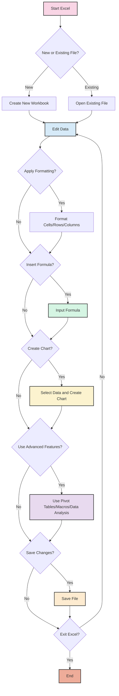
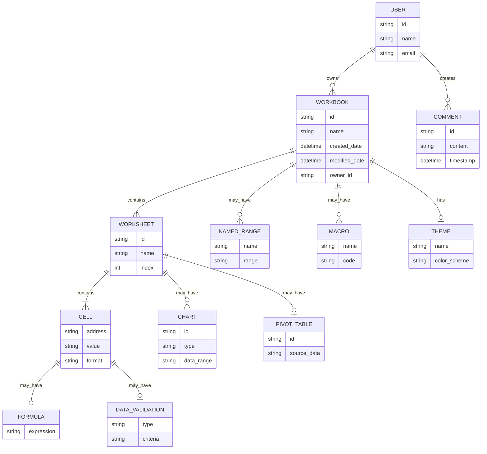
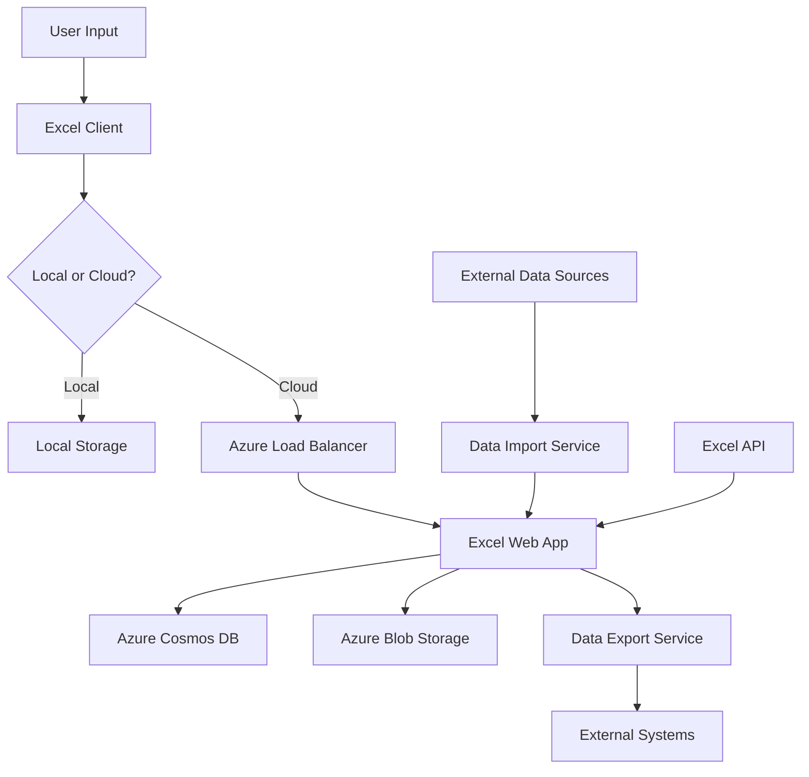

# INTRODUCTION

## PURPOSE

The purpose of this Software Requirements Specification (SRS) document is to provide a comprehensive and detailed description of the Microsoft Excel spreadsheet application. This document serves as the primary reference for the development team, project managers, quality assurance testers, and stakeholders involved in the creation and deployment of Microsoft Excel.

This SRS aims to:

1. Clearly define the functional and non-functional requirements of Microsoft Excel
2. Establish a shared understanding of the project scope and objectives among all stakeholders
3. Serve as a basis for project planning, cost estimation, and resource allocation
4. Provide a benchmark for validating the final product against the initial requirements
5. Act as a contractual agreement between the development team and stakeholders

The intended audience for this document includes:

- Software developers and engineers
- Project managers and team leads
- Quality assurance and testing teams
- User experience (UX) and user interface (UI) designers
- Technical writers and documentation specialists
- Business analysts and product owners
- Executive stakeholders and decision-makers
- Potential third-party integrators and add-in developers

## SCOPE

Microsoft Excel is a powerful and versatile spreadsheet application designed to revolutionize data management, analysis, and visualization for individuals and businesses across various industries. The software aims to provide an intuitive yet feature-rich platform that caters to both novice users and data professionals.

### Goals

1. Create a user-friendly interface that simplifies complex data operations
2. Develop a robust calculation engine capable of handling intricate formulas and large datasets
3. Provide advanced data analysis tools to support informed decision-making
4. Enable seamless collaboration and data sharing among users
5. Ensure cross-platform compatibility and integration with other productivity tools
6. Maintain high performance and reliability while handling large volumes of data

### Benefits

1. Increased productivity through efficient data organization and manipulation
2. Enhanced data analysis capabilities leading to better business insights
3. Improved collaboration and communication within teams and organizations
4. Reduced errors in calculations and data management
5. Time savings through automation of repetitive tasks
6. Flexibility to work across multiple devices and platforms
7. Seamless integration with other Microsoft Office applications

### Core Functionalities

1. Data Input and Management
   - Grid-based interface for data entry and editing
   - Support for various data types (numbers, text, dates, etc.)
   - Multiple worksheet support within a single workbook
   - Data import/export capabilities for various file formats

2. Calculation and Formula Engine
   - Comprehensive library of built-in functions and formulas
   - Support for custom function creation
   - Automatic and manual calculation modes
   - Array formulas and dynamic array support

3. Data Analysis Tools
   - Pivot Tables for data summarization and analysis
   - What-if analysis tools (Goal Seek, Scenario Manager, Data Tables)
   - Statistical analysis functions
   - Data filtering and sorting capabilities

4. Data Visualization
   - Wide range of chart types for graphical data representation
   - Conditional formatting for visual data analysis
   - Sparklines for inline data visualization
   - Custom data visualization options

5. Collaboration and Sharing
   - Real-time co-authoring capabilities
   - Cloud storage integration for easy file sharing and access
   - Version history and recovery features
   - Commenting and review functionalities

6. Automation and Customization
   - Macro recording and VBA programming support
   - Add-in support for extending functionality
   - Custom ribbon and quick access toolbar options

7. Cross-Platform Support
   - Desktop applications for Windows and macOS
   - Web-based version for browser access
   - Mobile applications for iOS and Android devices

8. Integration
   - Seamless integration with other Microsoft Office applications
   - Connectivity with external data sources (databases, web services, etc.)
   - API for third-party integrations and custom solutions

9. Security and Compliance
   - Data encryption and workbook protection features
   - Compliance with data protection regulations
   - Audit trail capabilities for enterprise environments

By delivering these core functionalities, Microsoft Excel aims to provide a comprehensive solution for data management and analysis needs across various industries and use cases, from personal finance tracking to complex business intelligence applications.

# PRODUCT DESCRIPTION

## PRODUCT PERSPECTIVE

Microsoft Excel is a cornerstone application within the broader Microsoft Office suite, designed to seamlessly integrate with other productivity tools while offering standalone spreadsheet functionality. It operates within the following context:

1. Microsoft Office Ecosystem: Excel is tightly integrated with other Office applications such as Word, PowerPoint, and Access, allowing for easy data exchange and embedding of spreadsheets in various document types.

2. Cloud Integration: As part of Microsoft's cloud strategy, Excel is deeply connected with OneDrive and SharePoint, enabling cloud storage, syncing, and real-time collaboration features.

3. Cross-Platform Environment: Excel is designed to function across multiple platforms, including Windows and macOS desktop environments, web browsers, and mobile devices (iOS and Android).

4. Enterprise Systems: In corporate settings, Excel often interfaces with larger enterprise systems, such as ERP and CRM solutions, acting as a front-end for data analysis and reporting.

5. Developer Ecosystem: Excel serves as a platform for third-party developers to create add-ins and custom solutions, extending its functionality to meet specific industry or business needs.

6. Data Analysis Landscape: Within the broader data analysis and business intelligence landscape, Excel positions itself as a versatile tool that bridges the gap between simple data management and complex analytics platforms.

## PRODUCT FUNCTIONS

Microsoft Excel provides a wide range of functions to support data management, analysis, and visualization:

1. Data Entry and Management
   - Grid-based interface for structured data input
   - Support for various data types (numbers, text, dates, currency)
   - Data validation and error checking
   - Multi-sheet workbooks for organizing related data

2. Calculation and Formulas
   - Extensive library of built-in functions (mathematical, statistical, financial, etc.)
   - Custom formula creation
   - Automatic recalculation and manual calculation modes
   - Array formulas and dynamic arrays for complex operations

3. Data Analysis
   - Pivot Tables for data summarization and cross-tabulation
   - What-if analysis tools (Goal Seek, Scenario Manager, Data Tables)
   - Statistical analysis functions
   - Solver add-in for optimization problems

4. Data Visualization
   - Wide range of chart types (bar, line, pie, scatter, etc.)
   - Conditional formatting for visual data representation
   - Sparklines for inline data trends
   - Advanced visualization features (treemaps, sunburst diagrams)

5. Collaboration and Sharing
   - Real-time co-authoring capabilities
   - Comments and review features
   - Version history and recovery
   - Sharing options with customizable permissions

6. Automation and Customization
   - Macro recording for task automation
   - VBA programming for advanced customization
   - Support for add-ins and extensions

7. Data Connectivity
   - Import/Export functionality for various file formats
   - Connections to external data sources (databases, web services)
   - Power Query for data transformation and cleansing

8. Mobile and Web Access
   - Responsive design for mobile device usage
   - Web-based version for browser access
   - Offline mode for working without internet connection

## USER CHARACTERISTICS

Microsoft Excel caters to a diverse user base with varying levels of expertise:

1. Novice Users
   - Characteristics: Limited spreadsheet experience, primarily using basic functions
   - Needs: Intuitive interface, simple data entry, basic calculations, and charting
   - Persona: Sarah, a small business owner tracking monthly expenses

2. Intermediate Users
   - Characteristics: Comfortable with common Excel features, some formula knowledge
   - Needs: More advanced formulas, data analysis tools, collaborative features
   - Persona: Mark, a marketing analyst creating reports and basic dashboards

3. Advanced Users
   - Characteristics: Proficient in complex Excel functions, macros, and data modeling
   - Needs: Advanced analytical tools, VBA programming, large dataset handling
   - Persona: Lisa, a financial analyst performing complex financial modeling

4. Data Scientists / Analysts
   - Characteristics: Expert-level Excel skills, often using Excel alongside other tools
   - Needs: Advanced statistical functions, big data handling, integration with BI tools
   - Persona: David, a data scientist using Excel for initial data exploration and visualization

5. Developers
   - Characteristics: Programming background, creating custom Excel solutions
   - Needs: Robust API, extensibility options, integration capabilities
   - Persona: Alex, a software developer creating custom add-ins for industry-specific use cases

6. Mobile Users
   - Characteristics: Accessing Excel on-the-go, need for quick edits and viewing
   - Needs: Responsive mobile interface, core functionality on smaller screens
   - Persona: Emma, a sales representative updating forecasts during client visits

## CONSTRAINTS

1. Technical Constraints
   - Must maintain backward compatibility with files from previous Excel versions
   - Limited by the processing power and memory of the user's device
   - Web version functionality limited by browser capabilities and security restrictions
   - Mobile versions constrained by screen size and touch interface requirements

2. Regulatory Constraints
   - Must comply with data protection regulations (e.g., GDPR, CCPA)
   - Required to meet accessibility standards (e.g., WCAG 2.1)
   - Financial calculation functions must adhere to accounting standards

3. Business Constraints
   - Development timeline must align with the broader Office suite release schedule
   - Pricing strategy needs to fit within the existing Microsoft 365 subscription model
   - Features must be prioritized to fit within the allocated budget and resources

4. User Experience Constraints
   - Interface changes limited to maintain familiarity for existing users
   - Performance requirements (e.g., file load times, calculation speed) for user satisfaction

5. Security Constraints
   - Must implement robust encryption for data protection
   - Need to balance functionality with security in macro and add-in capabilities

6. Platform Constraints
   - Features must be implemented consistently across Windows, macOS, web, and mobile platforms
   - Limited by the capabilities of the lowest common denominator among supported platforms

## ASSUMPTIONS AND DEPENDENCIES

### Assumptions

1. Users have basic computer literacy and familiarity with spreadsheet concepts
2. The majority of users have reliable internet access for cloud features and updates
3. Organizations will continue to value Excel skills in the workplace
4. The trend towards data-driven decision making will continue to grow
5. Users are willing to learn new features and adapt to interface changes

### Dependencies

1. Microsoft Azure cloud infrastructure for hosting web version and cloud services
2. Continued support for Windows and macOS operating systems
3. Ongoing compatibility with major web browsers (Chrome, Firefox, Safari, Edge)
4. Availability of third-party libraries and components used in development
5. Cooperation from other Microsoft teams for integration with Office suite applications
6. Timely updates to mobile operating systems (iOS and Android) to support new features
7. Availability of necessary development tools and environments
8. Continued market demand for spreadsheet and data analysis software
9. Stable regulatory environment regarding data protection and software licensing
10. Successful negotiation of licensing agreements for any third-party technologies used

By carefully considering these assumptions and dependencies, the development team can better anticipate potential challenges and plan for contingencies throughout the project lifecycle.

Here's a PROCESS FLOWCHART section for the Microsoft Excel SRS using Mermaid JS, maintaining consistency with the previously mentioned technologies and framework choices:

## PROCESS FLOWCHART

The following flowchart illustrates the high-level process flow for key operations in Microsoft Excel:

This flowchart represents the basic workflow of using Microsoft Excel, including:

1. Starting Excel and choosing between creating a new workbook or opening an existing file
2. Editing data in the spreadsheet
3. Applying formatting to cells, rows, or columns
4. Inserting formulas for calculations
5. Creating charts for data visualization
6. Using advanced features such as pivot tables, macros, or data analysis tools
7. Saving changes and potentially exiting the application

The process is cyclical, allowing users to return to the data editing stage at any point, reflecting the flexible and iterative nature of working with spreadsheets in Excel.

Key decision points are represented by diamond shapes, while actions are represented by rectangles. The flow allows for multiple paths depending on user choices, accommodating various use cases from simple data entry to complex data analysis.

This flowchart aligns with the previously described features and functionalities of Microsoft Excel, including its core spreadsheet capabilities, formula system, charting tools, and advanced features like pivot tables and macros. It also reflects the cross-platform nature of Excel by keeping the process generic enough to apply to desktop, web, and mobile versions of the application.

Here's a breakdown of Microsoft Excel's features with the requested sub-sections:

1. Data Input and Management

ID: F001
DESCRIPTION: Provides a grid-based interface for data entry and manipulation, supporting various data types and multiple worksheets within a workbook.
PRIORITY: High

| Requirement ID | Requirement Description | Priority |
|----------------|-------------------------|----------|
| F001-1 | Support for text, numbers, dates, and currency data types | High |
| F001-2 | Multiple worksheet support within a single workbook | High |
| F001-3 | Cell, row, and column formatting options | Medium |
| F001-4 | Data validation rules for input control | Medium |
| F001-5 | Undo/Redo functionality for user actions | High |

2. Formula and Calculation Engine

ID: F002
DESCRIPTION: Offers a comprehensive formula system with built-in functions, custom function creation, and various calculation modes.
PRIORITY: High

| Requirement ID | Requirement Description | Priority |
|----------------|-------------------------|----------|
| F002-1 | Library of 400+ built-in functions | High |
| F002-2 | Custom function creation capability | Medium |
| F002-3 | Automatic and manual calculation modes | High |
| F002-4 | Array formulas and dynamic array support | Medium |
| F002-5 | Formula error checking and debugging tools | Medium |

3. Data Analysis and Visualization

ID: F003
DESCRIPTION: Provides tools for data analysis including Pivot Tables, charts, and conditional formatting.
PRIORITY: High

| Requirement ID | Requirement Description | Priority |
|----------------|-------------------------|----------|
| F003-1 | Pivot Table functionality for data summarization | High |
| F003-2 | 20+ chart types for data visualization | High |
| F003-3 | Conditional formatting options | Medium |
| F003-4 | Data sorting and filtering capabilities | High |
| F003-5 | Sparklines for inline data visualization | Low |

4. Advanced Features

ID: F004
DESCRIPTION: Includes advanced functionalities such as macros, VBA support, and complex analysis tools.
PRIORITY: Medium

| Requirement ID | Requirement Description | Priority |
|----------------|-------------------------|----------|
| F004-1 | Macro recording and VBA programming support | Medium |
| F004-2 | What-if analysis tools (Goal Seek, Scenario Manager) | Medium |
| F004-3 | Solver add-in for optimization problems | Low |
| F004-4 | Data modeling capabilities | Medium |
| F004-5 | Power Query for data transformation | Low |

5. Collaboration and Sharing

ID: F005
DESCRIPTION: Enables real-time collaboration, file sharing, and version control.
PRIORITY: High

| Requirement ID | Requirement Description | Priority |
|----------------|-------------------------|----------|
| F005-1 | Real-time co-authoring capabilities | High |
| F005-2 | Comments and review features | Medium |
| F005-3 | File sharing with customizable permissions | High |
| F005-4 | Version history and recovery | Medium |
| F005-5 | Integration with Microsoft Teams | Low |

6. Cross-Platform Support

ID: F006
DESCRIPTION: Ensures Excel functionality across multiple platforms including Windows, macOS, web, and mobile devices.
PRIORITY: High

| Requirement ID | Requirement Description | Priority |
|----------------|-------------------------|----------|
| F006-1 | Windows desktop application | High |
| F006-2 | macOS desktop application | High |
| F006-3 | Web-based version | High |
| F006-4 | iOS mobile application | Medium |
| F006-5 | Android mobile application | Medium |

7. Data Connectivity and Import/Export

ID: F007
DESCRIPTION: Provides capabilities to connect to external data sources and import/export data in various formats.
PRIORITY: Medium

| Requirement ID | Requirement Description | Priority |
|----------------|-------------------------|----------|
| F007-1 | Import/Export functionality for various file formats | High |
| F007-2 | Connections to external databases | Medium |
| F007-3 | Web data scraping capabilities | Low |
| F007-4 | Real-time data feed connections | Low |
| F007-5 | Export to PDF and other document formats | Medium |

8. Security and Compliance

ID: F008
DESCRIPTION: Implements robust security measures and ensures compliance with data protection regulations.
PRIORITY: High

| Requirement ID | Requirement Description | Priority |
|----------------|-------------------------|----------|
| F008-1 | Workbook encryption capabilities | High |
| F008-2 | Compliance with GDPR, CCPA, and other regulations | High |
| F008-3 | Audit trail functionality for enterprise environments | Medium |
| F008-4 | Granular permission settings for shared workbooks | Medium |
| F008-5 | Integration with Microsoft Information Protection | Low |

9. Performance and Scalability

ID: F009
DESCRIPTION: Optimizes Excel for handling large datasets and complex calculations efficiently.
PRIORITY: High

| Requirement ID | Requirement Description | Priority |
|----------------|-------------------------|----------|
| F009-1 | Support for 1M+ rows of data | High |
| F009-2 | Multi-threaded calculation engine | High |
| F009-3 | Intelligent memory management | Medium |
| F009-4 | Asynchronous formula calculation | Medium |
| F009-5 | Performance monitoring and optimization tools | Low |

10. Integration and Extensibility

ID: F010
DESCRIPTION: Allows seamless integration with other Office applications and supports third-party add-ins.
PRIORITY: Medium

| Requirement ID | Requirement Description | Priority |
|----------------|-------------------------|----------|
| F010-1 | Integration with other Microsoft Office applications | High |
| F010-2 | Support for third-party add-ins | Medium |
| F010-3 | Excel API for programmatic access | Medium |
| F010-4 | Integration with Power BI | Low |
| F010-5 | Support for custom ribbons and UI modifications | Low |

This breakdown maintains consistency with the previously mentioned technologies and framework choices, including the cross-platform nature of Excel, its integration with the Microsoft ecosystem, and its advanced features like VBA and Power Query. The priorities are assigned based on the core functionality of a spreadsheet application and the evolving needs of modern users and businesses.

# NON-FUNCTIONAL REQUIREMENTS

## PERFORMANCE

| ID | Requirement | Description | Metric |
|----|-------------|-------------|--------|
| NFR-P1 | Calculation Speed | Excel shall perform 90% of formula calculations in under 1 second | <1 second for 90% of calculations |
| NFR-P2 | File Load Time | Excel shall load files up to 10MB in size within 3 seconds | <3 seconds for files up to 10MB |
| NFR-P3 | Charting Response | Excel shall generate and display charts within 2 seconds of data selection | <2 seconds for chart generation |
| NFR-P4 | Scrolling Performance | Excel shall maintain smooth scrolling performance for spreadsheets up to 1 million rows | 60 fps scrolling for up to 1M rows |
| NFR-P5 | Memory Usage | Excel shall not exceed 2GB of RAM usage for spreadsheets up to 100MB in size | <2GB RAM for 100MB spreadsheets |
| NFR-P6 | Startup Time | Excel shall start and be ready for use within 5 seconds on recommended hardware | <5 seconds startup time |
| NFR-P7 | Concurrent Users | Web version shall support up to 100 concurrent users editing the same spreadsheet | 100 concurrent users per spreadsheet |

## SAFETY

| ID | Requirement | Description |
|----|-------------|-------------|
| NFR-S1 | Data Recovery | Excel shall provide automatic recovery of unsaved changes in case of application or system crash |
| NFR-S2 | Version History | Excel shall maintain a version history of documents for the last 30 days, allowing users to revert to previous versions |
| NFR-S3 | Backup | Excel shall support automatic backup to cloud storage at user-defined intervals |
| NFR-S4 | Data Validation | Excel shall provide data validation features to prevent entry of invalid or potentially harmful data |
| NFR-S5 | Macro Safety | Excel shall run macros in a sandboxed environment to prevent system-level access or modifications |
| NFR-S6 | File Corruption Prevention | Excel shall implement measures to prevent file corruption during saving and editing operations |

## SECURITY

| ID | Requirement | Description |
|----|-------------|-------------|
| NFR-SE1 | Authentication | Excel shall support multi-factor authentication for user access |
| NFR-SE2 | Authorization | Excel shall implement role-based access control for shared documents |
| NFR-SE3 | Data Encryption | Excel shall use AES-256 encryption for data at rest and TLS 1.3 for data in transit |
| NFR-SE4 | Privacy Controls | Excel shall provide granular privacy settings for shared documents and user data |
| NFR-SE5 | Audit Logging | Excel shall maintain detailed audit logs of all user actions for enterprise environments |
| NFR-SE6 | Secure Macros | Excel shall digitally sign and verify macros to prevent execution of unauthorized code |
| NFR-SE7 | Data Loss Prevention | Excel shall integrate with Microsoft Information Protection for data loss prevention |

## QUALITY

### Availability

| ID | Requirement | Description | Metric |
|----|-------------|-------------|--------|
| NFR-Q1 | Uptime | Excel web and cloud services shall maintain 99.9% uptime | 99.9% uptime |
| NFR-Q2 | Offline Functionality | Excel desktop and mobile apps shall provide core functionality without internet connection | 100% core features available offline |

### Maintainability

| ID | Requirement | Description | Metric |
|----|-------------|-------------|--------|
| NFR-Q3 | Code Modularity | Excel codebase shall be modular to facilitate easy maintenance and updates | 80% code coverage by unit tests |
| NFR-Q4 | Automated Testing | Excel shall have comprehensive automated testing suite | 90% of features covered by automated tests |

### Usability

| ID | Requirement | Description | Metric |
|----|-------------|-------------|--------|
| NFR-Q5 | Learnability | New users shall be able to perform basic tasks without training | 90% success rate for basic tasks by new users |
| NFR-Q6 | Accessibility | Excel shall comply with WCAG 2.1 Level AA standards | 100% compliance with WCAG 2.1 Level AA |

### Scalability

| ID | Requirement | Description | Metric |
|----|-------------|-------------|--------|
| NFR-Q7 | Data Handling | Excel shall efficiently handle spreadsheets with up to 1 million rows and 16,384 columns | Support for 1M rows and 16,384 columns |
| NFR-Q8 | User Scalability | Excel web version shall support linear scaling of concurrent users | Linear scaling up to 10,000 concurrent users |

### Reliability

| ID | Requirement | Description | Metric |
|----|-------------|-------------|--------|
| NFR-Q9 | Error Rate | Excel shall maintain a low error rate in calculations | <0.001% error rate in calculations |
| NFR-Q10 | Data Integrity | Excel shall ensure data integrity during all operations | 100% data integrity preservation |

## COMPLIANCE

| ID | Requirement | Description |
|----|-------------|-------------|
| NFR-C1 | GDPR Compliance | Excel shall comply with General Data Protection Regulation (GDPR) requirements |
| NFR-C2 | CCPA Compliance | Excel shall comply with California Consumer Privacy Act (CCPA) requirements |
| NFR-C3 | HIPAA Compliance | Excel shall provide features to support Health Insurance Portability and Accountability Act (HIPAA) compliance |
| NFR-C4 | SOC 2 Compliance | Excel shall maintain SOC 2 Type II compliance for cloud services |
| NFR-C5 | ISO 27001 | Excel development and operations shall adhere to ISO 27001 information security standards |
| NFR-C6 | Accessibility Standards | Excel shall comply with Section 508 of the Rehabilitation Act and EN 301 549 standards |
| NFR-C7 | Financial Regulations | Excel's financial functions shall comply with International Accounting Standards (IAS) |

These non-functional requirements are designed to ensure that Microsoft Excel meets high standards of performance, safety, security, quality, and compliance across all platforms (Windows, macOS, web, and mobile). They align with the previously mentioned technologies and framework choices, including the use of cloud services, cross-platform development, and integration with the Microsoft ecosystem. The requirements also reflect the need for enterprise-grade features, such as advanced security measures and compliance with various regulations, which are crucial for Excel's wide range of users from individuals to large corporations.

# DATA REQUIREMENTS

## DATA MODELS

Microsoft Excel's data model is designed to efficiently represent and manage spreadsheet data across various platforms. The core entities and their relationships are illustrated in the following entity-relationship diagram:

This data model supports the core functionality of Excel across all platforms (Windows, macOS, web, and mobile), ensuring consistency and interoperability.

## DATA STORAGE

Excel's data storage strategy is designed to support large-scale operations while ensuring data integrity, security, and accessibility across platforms.

### Storage Architecture

1. Local Storage:
   - Desktop applications (Windows and macOS) use a proprietary file format (.xlsx) for local storage.
   - Mobile applications use a combination of the .xlsx format and a local database (SQLite) for offline functionality.

2. Cloud Storage:
   - Microsoft Azure Blob Storage is used for storing workbooks in the cloud.
   - Azure Cosmos DB is utilized for storing metadata, user information, and collaboration data.

### Data Retention

1. Version History:
   - The system maintains the last 100 versions of each workbook or 30 days of history, whichever is greater.
   - Older versions are automatically archived to cold storage after 90 days.

2. Deleted Items:
   - Deleted workbooks are moved to a "Recycle Bin" and retained for 30 days before permanent deletion.
   - Administrators can recover deleted items within this period.

### Redundancy and Backup

1. Geo-Redundancy:
   - All cloud data is replicated across multiple geographic regions using Azure's geo-redundant storage.

2. Backup Schedule:
   - Full backups are performed weekly.
   - Incremental backups are performed daily.
   - Transaction logs are backed up every 5 minutes.

3. Backup Retention:
   - Daily backups are retained for 30 days.
   - Weekly backups are retained for 3 months.
   - Monthly backups are retained for 1 year.

### Recovery

1. Point-in-Time Recovery:
   - The system supports point-in-time recovery for the last 30 days.

2. Disaster Recovery:
   - A disaster recovery site is maintained in a separate geographic region.
   - Recovery Time Objective (RTO): 4 hours
   - Recovery Point Objective (RPO): 15 minutes

3. Self-Service Recovery:
   - Users can restore previous versions of their workbooks through the Excel interface.

## DATA PROCESSING

Excel's data processing capabilities are designed to handle large volumes of data efficiently while maintaining security and integrity.

### Data Flow

The following diagram illustrates the high-level data flow within the Excel ecosystem:

### Data Security

1. Encryption:
   - All data in transit is encrypted using TLS 1.3.
   - Data at rest is encrypted using AES-256 encryption.

2. Access Control:
   - Role-Based Access Control (RBAC) is implemented for all data access.
   - Multi-Factor Authentication (MFA) is required for accessing sensitive data.

3. Data Masking:
   - Sensitive data is masked in non-production environments.

4. Audit Logging:
   - All data access and modifications are logged for audit purposes.

### Data Processing Features

1. Real-time Collaboration:
   - Changes are processed and synced in real-time for collaborative editing.
   - Conflict resolution algorithms ensure data consistency.

2. Calculation Engine:
   - A multi-threaded calculation engine processes complex formulas efficiently.
   - Asynchronous calculation is supported for large workbooks.

3. Data Transformation:
   - Power Query is integrated for advanced data transformation capabilities.
   - Data cleansing and normalization are performed during import processes.

4. Big Data Processing:
   - Integration with Azure Synapse Analytics for processing extremely large datasets.
   - Support for connecting to and analyzing big data sources like Hadoop and Spark.

5. Machine Learning Integration:
   - Azure Machine Learning integration for predictive analytics within Excel.

6. Data Validation:
   - Input validation is performed at the cell level to ensure data integrity.
   - Custom validation rules can be defined by users.

7. Caching:
   - Intelligent caching mechanisms are implemented to improve performance for frequently accessed data.

By implementing these data requirements, Microsoft Excel ensures robust data management, processing, and security across all supported platforms, catering to both individual users and enterprise-scale deployments.

# EXTERNAL INTERFACES

## USER INTERFACES

Microsoft Excel's user interface is designed to be intuitive, efficient, and consistent across all supported platforms (Windows, macOS, web, and mobile). The interface requirements are as follows:

1. Ribbon-style toolbar
   - Organized into logical tabs (e.g., Home, Insert, Page Layout, Formulas, Data, Review, View)
   - Contextual tabs that appear based on selected objects (e.g., Chart Tools, Table Tools)
   - Quick Access Toolbar for frequently used commands

2. Grid-based worksheet area
   - Resizable columns and rows
   - Freeze panes functionality for large datasets
   - Zoom controls for adjusting view

3. Formula bar
   - Expandable for editing long formulas
   - Function wizard integration

4. Sheet tabs
   - Add, delete, rename, and reorder capabilities
   - Color coding options

5. Status bar
   - Quick calculations (sum, average, count) of selected cells
   - Zoom slider
   - View mode indicators (Normal, Page Layout, Page Break Preview)

6. Sidebar for advanced features
   - Pivot Table fields
   - Data validation rules
   - Conditional formatting manager

7. Dialog boxes and task panes
   - Consistent design language across all platforms
   - Keyboard shortcuts for improved accessibility

8. Mobile-specific interface elements
   - Touch-optimized controls
   - Simplified ribbon for smaller screens
   - Gesture support (pinch-to-zoom, swipe to scroll)

9. Accessibility features
   - High contrast mode
   - Screen reader compatibility
   - Keyboard navigation support

[Placeholder for UI mockups]

## HARDWARE INTERFACES

While Microsoft Excel is primarily a software application, it interfaces with various hardware components to enhance user experience and functionality:

1. Input Devices
   - Keyboard: Standard input for data entry and navigation
   - Mouse/Trackpad: For point-and-click interactions and selections
   - Touch screens: Support for touch input on compatible devices
   - Stylus: Precision input for tablet devices

2. Display
   - Support for various screen resolutions and aspect ratios
   - Multi-monitor support for extended workspace
   - High DPI display compatibility

3. Storage Devices
   - Local hard drives and SSDs for file storage and retrieval
   - USB drives for portable storage options

4. Printers
   - Interface with local and network printers for document output
   - Support for various paper sizes and orientations

5. Cameras
   - Integration with device cameras for image insertion into spreadsheets

6. Biometric Devices
   - Fingerprint readers for secure login (where available)

7. Network Hardware
   - Wi-Fi and Ethernet adapters for internet connectivity and cloud features

## SOFTWARE INTERFACES

Microsoft Excel interacts with various software systems and components:

1. Operating Systems
   - Windows: Version 10 and later
   - macOS: Version 10.14 (Mojave) and later
   - iOS: Version 13.0 and later
   - Android: Version 8.0 and later

2. Web Browsers (for web version)
   - Google Chrome: Latest version and two previous major releases
   - Mozilla Firefox: Latest version and two previous major releases
   - Apple Safari: Latest version and one previous major release
   - Microsoft Edge: Latest version and one previous major release

3. Microsoft Office Suite
   - Seamless integration with Word, PowerPoint, and other Office applications
   - Shared clipboard for cross-application data transfer
   - Linked objects and embedded charts

4. Cloud Storage Services
   - Microsoft OneDrive: Primary cloud storage and syncing service
   - SharePoint: For enterprise document management
   - Support for third-party services (Dropbox, Google Drive) through APIs

5. Database Management Systems
   - Microsoft SQL Server
   - MySQL
   - Oracle Database
   - PostgreSQL

6. External Data Sources
   - Web services and APIs
   - XML and JSON data feeds
   - ODBC and JDBC connections

7. Add-in Ecosystem
   - Support for COM add-ins (Windows)
   - Office JavaScript API for cross-platform add-ins

8. Version Control Systems
   - Integration with Git for spreadsheet version control (enterprise feature)

9. Collaboration Tools
   - Microsoft Teams integration for real-time collaboration
   - Skype for Business for communication within spreadsheets

10. Security Software
    - Integration with Microsoft Information Protection for data loss prevention
    - Support for third-party antivirus scanning of spreadsheet files

## COMMUNICATION INTERFACES

Microsoft Excel utilizes various communication interfaces to enable data exchange, collaboration, and integration with external systems:

1. Network Protocols
   - HTTP/HTTPS for web-based communication and API requests
   - WebSocket for real-time collaboration features
   - FTP/SFTP for file transfer operations

2. Data Formats
   - XML for data exchange and file formats (.xlsx, .xltx)
   - JSON for API communications
   - CSV for simple data import/export
   - OData for querying and updating data

3. API Interfaces
   - RESTful API for third-party integrations and add-ins
   - GraphQL API for efficient data querying (future implementation)

4. Authentication Protocols
   - OAuth 2.0 for secure API authentication
   - SAML for enterprise single sign-on integration

5. Encryption
   - TLS 1.3 for secure data transmission
   - AES-256 for file-level encryption

6. Real-time Collaboration
   - Operational Transformation (OT) protocol for concurrent editing
   - WebRTC for peer-to-peer data channels in co-authoring sessions

7. Synchronization
   - Microsoft Sync Framework for offline/online data synchronization
   - Delta sync for efficient updates of large spreadsheets

8. Notification Systems
   - WebHooks for event-driven notifications to external systems
   - Push notifications for mobile devices

9. Printing Protocols
   - IPP (Internet Printing Protocol) for network printing
   - PDF generation for universal print support

10. Accessibility Interfaces
    - ARIA (Accessible Rich Internet Applications) for improved screen reader compatibility

11. Localization
    - Unicode support for multi-language interfaces
    - ICU (International Components for Unicode) for locale-specific data formatting

These communication interfaces ensure that Microsoft Excel can effectively interact with a wide range of external systems, services, and devices, maintaining its position as a versatile and powerful spreadsheet application across all supported platforms.

# APPENDICES

## GLOSSARY

- **Cell**: The basic unit of a spreadsheet, where data is entered and stored.
- **Formula**: An expression that calculates values in a cell or range of cells.
- **Function**: A predefined formula that performs calculations using specific values in a particular order.
- **Workbook**: A file that contains one or more worksheets.
- **Worksheet**: A single spreadsheet within a workbook.
- **Pivot Table**: A data summarization tool that can automatically sort, count, total, or average data stored in a table.
- **Macro**: A series of commands and instructions that you group together as a single command to accomplish a task automatically.
- **VBA**: Visual Basic for Applications, a programming language used to create macros in Excel.
- **Chart**: A graphical representation of data in a worksheet.
- **Conditional Formatting**: A feature that changes the appearance of cells based on specified conditions.
- **Data Validation**: A feature that restricts the type of data or values that users can enter into a cell.
- **Named Range**: A name assigned to a cell or range of cells to make formulas easier to understand and maintain.
- **Sparkline**: A small chart in a worksheet cell that provides a visual representation of data.
- **Array Formula**: A formula that can perform multiple calculations on one or more items in an array.
- **Dynamic Array**: A feature that allows formulas to return multiple results spilling into neighboring cells.

## ACRONYMS

- **API**: Application Programming Interface
- **CSV**: Comma-Separated Values
- **GDPR**: General Data Protection Regulation
- **CCPA**: California Consumer Privacy Act
- **HIPAA**: Health Insurance Portability and Accountability Act
- **UI**: User Interface
- **UX**: User Experience
- **VBA**: Visual Basic for Applications
- **XML**: Extensible Markup Language
- **JSON**: JavaScript Object Notation
- **REST**: Representational State Transfer
- **ODBC**: Open Database Connectivity
- **JDBC**: Java Database Connectivity
- **SSL**: Secure Sockets Layer
- **TLS**: Transport Layer Security
- **AES**: Advanced Encryption Standard
- **MFA**: Multi-Factor Authentication
- **RBAC**: Role-Based Access Control
- **SaaS**: Software as a Service
- **API**: Application Programming Interface
- **SDK**: Software Development Kit

## ADDITIONAL REFERENCES

1. Microsoft Excel Documentation: https://docs.microsoft.com/en-us/office/client-developer/excel/

2. OpenXML SDK Documentation: https://docs.microsoft.com/en-us/office/open-xml/open-xml-sdk

3. W3C XML Specifications: https://www.w3.org/XML/

4. ECMA Office Open XML Standards: https://www.ecma-international.org/publications-and-standards/standards/ecma-376/

5. OAuth 2.0 Specification: https://oauth.net/2/

6. WebSocket Protocol: https://tools.ietf.org/html/rfc6455

7. REST API Design Best Practices: https://restfulapi.net/

8. Microsoft Azure Documentation: https://docs.microsoft.com/en-us/azure/

9. Web Content Accessibility Guidelines (WCAG) 2.1: https://www.w3.org/TR/WCAG21/

10. General Data Protection Regulation (GDPR): https://gdpr-info.eu/

11. California Consumer Privacy Act (CCPA): https://oag.ca.gov/privacy/ccpa

12. Health Insurance Portability and Accountability Act (HIPAA): https://www.hhs.gov/hipaa/index.html

13. ISO/IEC 27001 Information Security Standard: https://www.iso.org/isoiec-27001-information-security.html

14. NIST Cybersecurity Framework: https://www.nist.gov/cyberframework

These additional references provide in-depth information on various technologies, standards, and regulations relevant to the development and compliance of Microsoft Excel. They serve as valuable resources for the development team, security experts, and compliance officers working on the project.