# INTRODUCTION

## SYSTEM OVERVIEW

Microsoft Excel is a comprehensive spreadsheet application designed to provide powerful data management, analysis, and visualization capabilities across multiple platforms. The system is composed of several interconnected components that work together to deliver a seamless user experience for both individual users and enterprise-level organizations.

### Key Components

1. **Core Spreadsheet Engine**: The foundation of Excel, responsible for data storage, manipulation, and calculation.

2. **User Interface Layer**: Provides intuitive access to Excel's features across desktop, web, and mobile platforms.

3. **Formula and Function Library**: A vast collection of built-in functions and the ability to create custom formulas.

4. **Data Analysis Tools**: Including Pivot Tables, What-If Analysis, and statistical functions.

5. **Visualization Engine**: Generates charts, graphs, and other visual representations of data.

6. **Collaboration Platform**: Enables real-time co-authoring and sharing of workbooks.

7. **Add-in and Extensibility Framework**: Allows for the integration of third-party tools and custom functionality.

8. **Cloud Services**: Provides storage, synchronization, and advanced processing capabilities.

9. **Security and Compliance Module**: Ensures data protection and adherence to regulatory standards.

10. **Cross-Platform Compatibility Layer**: Ensures consistent functionality across Windows, macOS, web, and mobile platforms.

### System Architecture

The following diagram illustrates the high-level architecture of Microsoft Excel:

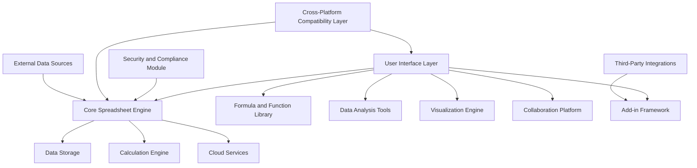

### Key Features

1. **Data Management**:
   - Support for large datasets (up to 1,048,576 rows by 16,384 columns)
   - Multiple data types (numbers, text, dates, currencies)
   - Data validation and error checking

2. **Calculation Capabilities**:
   - Over 400 built-in functions
   - Support for complex formulas and array calculations
   - Real-time calculation updates

3. **Data Analysis**:
   - Pivot Tables for data summarization
   - What-If Analysis tools (Goal Seek, Scenario Manager)
   - Statistical analysis functions

4. **Data Visualization**:
   - Wide range of chart types
   - Conditional formatting
   - Sparklines for inline data visualization

5. **Collaboration**:
   - Real-time co-authoring
   - Comments and review features
   - Version history and recovery

6. **Extensibility**:
   - Support for VBA macros
   - Office Add-in platform for web-based extensions
   - Integration with external data sources and services

7. **Cross-Platform Functionality**:
   - Consistent core features across Windows, macOS, web, and mobile platforms
   - Cloud synchronization for seamless transition between devices

8. **Security and Compliance**:
   - End-to-end encryption for data in transit and at rest
   - Compliance with GDPR, CCPA, and other regulatory standards
   - Advanced threat protection and data loss prevention features

### Integration with Microsoft Ecosystem

Excel is deeply integrated with other Microsoft products and services:

| Microsoft Product | Integration Features |
|-------------------|----------------------|
| OneDrive/SharePoint | Cloud storage and synchronization |
| Power BI | Advanced data analysis and visualization |
| Microsoft Teams | Collaborative workspaces and file sharing |
| Dynamics 365 | Data import and export for business processes |
| Azure | Cloud computing and big data processing |
| Office 365 | Seamless integration with Word, PowerPoint, etc. |

This system overview provides a high-level understanding of Microsoft Excel's architecture, key components, and features. The application's design allows for scalability, extensibility, and cross-platform compatibility, making it a versatile tool for a wide range of users and use cases.

# SYSTEM ARCHITECTURE

## PROGRAMMING LANGUAGES

The following programming languages will be used in the development of Microsoft Excel, chosen for their specific strengths and suitability for different aspects of the application:

| Language | Purpose | Justification |
|----------|---------|---------------|
| C++ | Core engine, performance-critical components | High performance, low-level control, cross-platform compatibility |
| C# | Windows desktop application, .NET integration | Robust Windows integration, extensive .NET libraries |
| Swift | macOS and iOS applications | Native performance and UI integration for Apple platforms |
| Kotlin | Android application | Modern language for Android development, interoperability with Java |
| JavaScript/TypeScript | Web application, cross-platform add-ins | Wide browser support, rich ecosystem for web development |
| Python | Data analysis features, scripting | Extensive data science libraries, ease of use for end-user scripting |
| VBA | Macro programming | Backward compatibility, user-familiar scripting language |
| SQL | Database queries and management | Standard language for database operations |

## HIGH-LEVEL ARCHITECTURE DIAGRAM

The following diagram provides an overview of Microsoft Excel's high-level architecture:

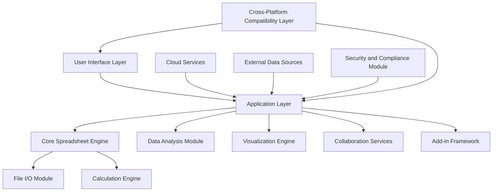

## COMPONENT DIAGRAMS

### Core Spreadsheet Engine

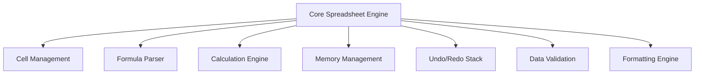

### Data Analysis Module

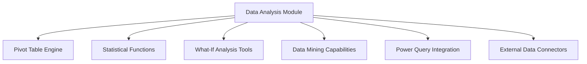

### Visualization Engine

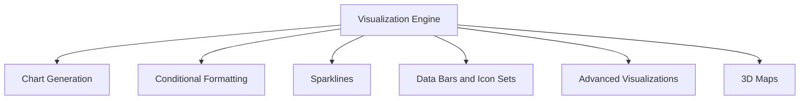

## SEQUENCE DIAGRAMS

### Formula Calculation Sequence

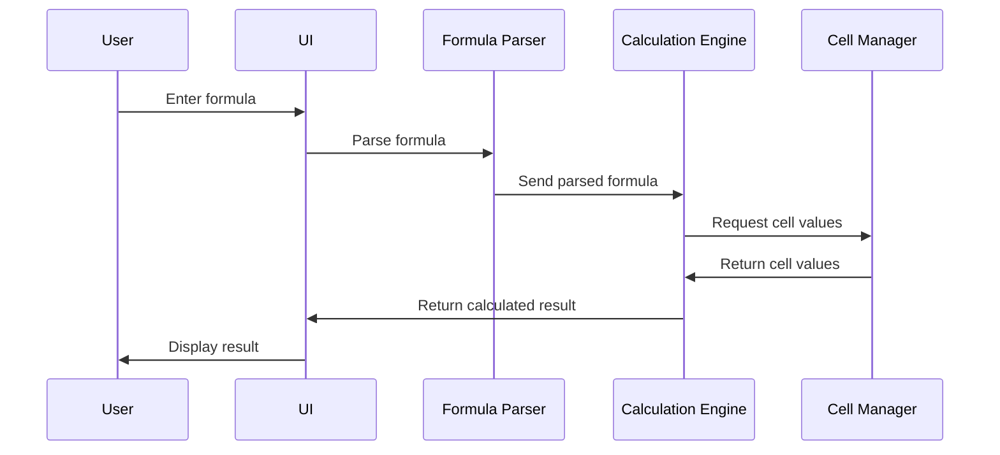

### Collaborative Editing Sequence

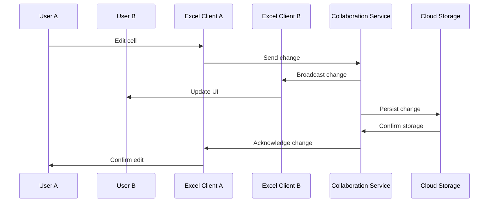

## DATA-FLOW DIAGRAM

The following diagram illustrates how data flows through the Microsoft Excel system:

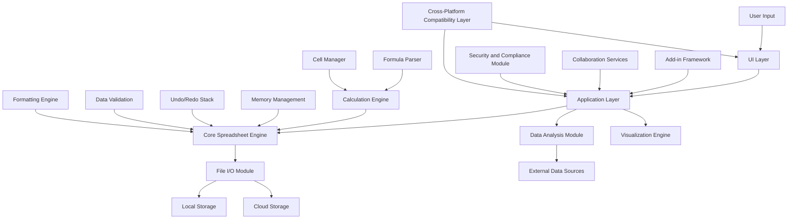

This data flow diagram shows how information moves through the various components of Microsoft Excel. User input enters through the UI Layer, which interacts with the Application Layer. The Application Layer coordinates with the Core Spreadsheet Engine for basic spreadsheet operations, the Data Analysis Module for advanced analysis, and the Visualization Engine for creating charts and graphs.

Data can be stored locally or in the cloud through the File I/O Module. The Add-in Framework, Collaboration Services, and Security and Compliance Module all interact with the Application Layer to provide extended functionality, real-time collaboration, and ensure data protection respectively.

The Core Spreadsheet Engine contains several sub-components, including the Calculation Engine, Formula Parser, Cell Manager, and others, which work together to handle the fundamental spreadsheet operations.

The Cross-Platform Compatibility Layer ensures that data and functionality are consistent across different platforms and devices.

This architecture allows for efficient data processing, scalability, and the flexibility to add new features and integrations while maintaining the core spreadsheet functionality that users expect from Microsoft Excel.

# SYSTEM DESIGN

## PROGRAMMING LANGUAGES

The following programming languages will be used in the development of Microsoft Excel, chosen for their specific strengths and suitability for different aspects of the application:

| Language | Purpose | Justification |
|----------|---------|---------------|
| C++ | Core engine, performance-critical components | High performance, low-level control, cross-platform compatibility |
| C# | Windows desktop application, .NET integration | Robust Windows integration, extensive .NET libraries |
| Swift | macOS and iOS applications | Native performance and UI integration for Apple platforms |
| Kotlin | Android application | Modern language for Android development, interoperability with Java |
| JavaScript/TypeScript | Web application, cross-platform add-ins | Wide browser support, rich ecosystem for web development |
| Python | Data analysis features, scripting | Extensive data science libraries, ease of use for end-user scripting |
| VBA | Macro programming | Backward compatibility, user-familiar scripting language |
| SQL | Database queries and management | Standard language for database operations |

## DATABASE DESIGN

Microsoft Excel primarily uses file-based storage for workbooks, but also utilizes databases for certain features and cloud-based operations. The database design includes:

1. User Data Store (Azure Cosmos DB)

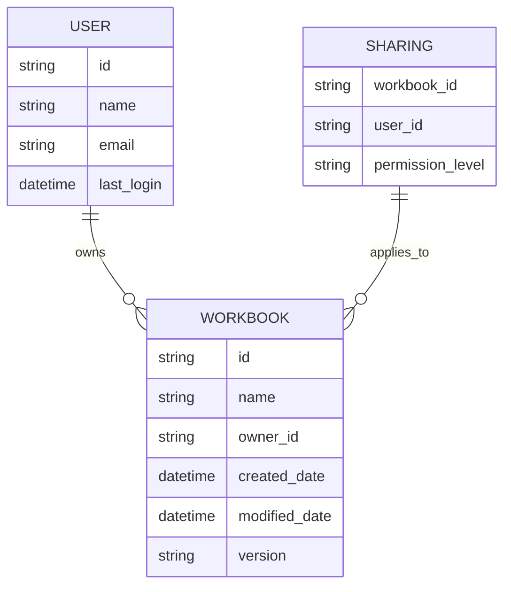

2. Collaboration Data Store (Azure Cosmos DB)

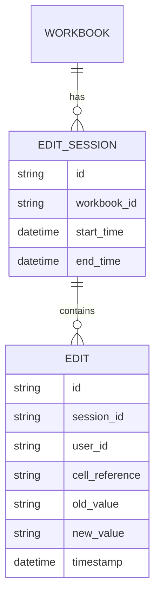

3. Analytics Data Store (Azure SQL Database)

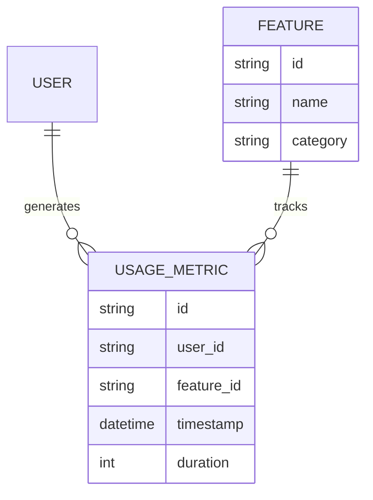

## API DESIGN

Microsoft Excel's API is designed to provide comprehensive access to Excel's functionality for add-ins and external integrations. The API follows RESTful principles and uses JSON for data exchange.

1. Workbook Operations

```markdown
GET /api/v1/workbooks
POST /api/v1/workbooks
GET /api/v1/workbooks/{id}
PUT /api/v1/workbooks/{id}
DELETE /api/v1/workbooks/{id}
```

2. Worksheet Operations

```markdown
GET /api/v1/workbooks/{id}/worksheets
POST /api/v1/workbooks/{id}/worksheets
GET /api/v1/workbooks/{id}/worksheets/{sheet_id}
PUT /api/v1/workbooks/{id}/worksheets/{sheet_id}
DELETE /api/v1/workbooks/{id}/worksheets/{sheet_id}
```

3. Cell Operations

```markdown
GET /api/v1/workbooks/{id}/worksheets/{sheet_id}/cells/{range}
PUT /api/v1/workbooks/{id}/worksheets/{sheet_id}/cells/{range}
```

4. Formula Operations

```markdown
POST /api/v1/workbooks/{id}/formulas/evaluate
GET /api/v1/functions
```

5. Chart Operations

```markdown
GET /api/v1/workbooks/{id}/charts
POST /api/v1/workbooks/{id}/charts
GET /api/v1/workbooks/{id}/charts/{chart_id}
PUT /api/v1/workbooks/{id}/charts/{chart_id}
DELETE /api/v1/workbooks/{id}/charts/{chart_id}
```

6. Collaboration

```markdown
GET /api/v1/workbooks/{id}/collaborators
POST /api/v1/workbooks/{id}/collaborators
DELETE /api/v1/workbooks/{id}/collaborators/{user_id}
```

## USER INTERFACE DESIGN

The user interface for Microsoft Excel is designed to be intuitive, efficient, and consistent across all supported platforms (Windows, macOS, web, and mobile). Key components include:

1. Ribbon Interface


2. Worksheet Grid

```markdown
+---+---+---+---+
| A | B | C | D |
+---+---+---+---+
| 1 |   |   |   |
+---+---+---+---+
| 2 |   |   |   |
+---+---+---+---+
| 3 |   |   |   |
+---+---+---+---+
```

3. Formula Bar

```markdown
fx: =SUM(A1:A10)
```

4. Quick Access Toolbar


5. Status Bar

```markdown
Ready | Sheet 1 of 3 | 100% | Page 1 | Rec | Macro | Caps
```

6. Sidebar (Context-sensitive)

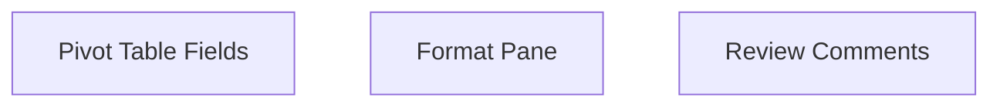

7. Mobile Interface Adaptations

- Simplified ribbon for touch interfaces
- Gesture support (pinch-to-zoom, swipe to scroll)
- Optimized layout for smaller screens

The user interface design prioritizes:

- Consistency across platforms
- Accessibility features (high contrast, screen reader support)
- Customizability (Quick Access Toolbar, custom ribbons)
- Contextual tools and options
- Efficient navigation for both novice and expert users

This system design aligns with the previously established requirements and technologies, ensuring a robust, scalable, and user-friendly implementation of Microsoft Excel across all supported platforms.

# TECHNOLOGY STACK

## PROGRAMMING LANGUAGES

The following programming languages will be used in the development of Microsoft Excel, chosen for their specific strengths and suitability for different aspects of the application:

| Language | Purpose | Justification |
|----------|---------|---------------|
| C++ | Core engine, performance-critical components | High performance, low-level control, cross-platform compatibility |
| C# | Windows desktop application, .NET integration | Robust Windows integration, extensive .NET libraries |
| Swift | macOS and iOS applications | Native performance and UI integration for Apple platforms |
| Kotlin | Android application | Modern language for Android development, interoperability with Java |
| JavaScript/TypeScript | Web application, cross-platform add-ins | Wide browser support, rich ecosystem for web development |
| Python | Data analysis features, scripting | Extensive data science libraries, ease of use for end-user scripting |
| VBA | Macro programming | Backward compatibility, user-familiar scripting language |
| SQL | Database queries and management | Standard language for database operations |

## FRAMEWORKS AND LIBRARIES

The following frameworks and libraries will be utilized in the development of Microsoft Excel:

| Framework/Library | Purpose | Justification |
|-------------------|---------|---------------|
| .NET Core | Cross-platform development for desktop and web | Unified framework for Windows, macOS, and web development |
| React | Web application front-end | Component-based architecture, virtual DOM for performance |
| Electron | Desktop application wrapper for web version | Cross-platform desktop support using web technologies |
| NumPy | Numerical computing for data analysis features | Efficient numerical operations, integration with Python |
| Pandas | Data manipulation and analysis | Powerful data structures for analysis in Python |
| Chart.js | Charting and visualization | Flexible, responsive charts for web and mobile |
| SignalR | Real-time communication for collaboration features | Simplified real-time web functionality for .NET |
| Boost | C++ utility and performance enhancements | Extensive, well-tested C++ libraries for core engine |
| ANTLR | Formula parsing and language processing | Robust parser generation for complex formula syntax |
| OpenXML SDK | File format handling | Official toolkit for working with Office Open XML formats |

## DATABASES

The following database systems will be employed in Microsoft Excel:

| Database | Purpose | Justification |
|----------|---------|---------------|
| Azure Cosmos DB | Cloud-based document storage, user data | Globally distributed, multi-model database for cloud-scale applications |
| SQLite | Local storage for mobile and offline functionality | Lightweight, serverless database for local data persistence |
| Azure SQL Database | Relational data storage for enterprise features | Managed SQL database service with high performance and scalability |
| Redis | Caching and session management | In-memory data structure store for fast data access and caching |

## THIRD-PARTY SERVICES

The following external services and APIs will be integrated into Microsoft Excel:

| Service/API | Purpose | Justification |
|-------------|---------|---------------|
| Microsoft Graph API | Integration with Office 365 ecosystem | Unified API for accessing Microsoft cloud services |
| Azure Active Directory | Authentication and user management | Enterprise-grade identity and access management |
| OneDrive API | Cloud storage and file synchronization | Seamless integration with Microsoft's cloud storage solution |
| Power BI API | Advanced data visualization and business intelligence | Integration with Microsoft's BI tools for enhanced analytics |
| Bing Maps API | Geospatial data visualization | Location-based data representation and analysis |
| LinkedIn API | Professional data integration | Enhanced data import options for business users |
| Currency Conversion API | Real-time currency data | Up-to-date exchange rates for financial calculations |
| Stock Market API | Financial data integration | Real-time and historical stock data for financial analysis |
| Azure Cognitive Services | AI and machine learning capabilities | Integration of intelligent features like text analytics and image recognition |
| GitHub API | Version control integration | Collaboration and version tracking for enterprise users |

This technology stack is designed to provide a robust, scalable, and feature-rich foundation for Microsoft Excel across all supported platforms (Windows, macOS, web, and mobile). It leverages Microsoft's existing technologies while incorporating industry-standard tools and services to ensure optimal performance, compatibility, and extensibility.

# SECURITY CONSIDERATIONS

## AUTHENTICATION AND AUTHORIZATION

Microsoft Excel implements a robust authentication and authorization system to ensure secure access across all platforms (Windows, macOS, web, and mobile).

### Authentication Methods

1. Microsoft Account Integration
   - Single Sign-On (SSO) with Microsoft accounts
   - Support for personal and work/school accounts

2. Multi-Factor Authentication (MFA)
   - SMS-based verification
   - Authenticator app support
   - Biometric authentication (fingerprint, facial recognition) on supported devices

3. OAuth 2.0
   - Used for third-party application integrations
   - Supports authorization code flow and PKCE for mobile apps

4. SAML 2.0
   - For enterprise Single Sign-On integration

### Authorization Model

Excel uses Role-Based Access Control (RBAC) to manage user permissions:

| Role | Description | Permissions |
|------|-------------|-------------|
| Viewer | Can only view spreadsheets | Read-only access |
| Editor | Can edit spreadsheets | Read and write access |
| Reviewer | Can add comments and suggestions | Read access, comment creation |
| Owner | Full control over the spreadsheet | All permissions, including sharing and deletion |
| Admin | Organizational-level control | Manage users, set policies, access all spreadsheets |

### Authorization Flow

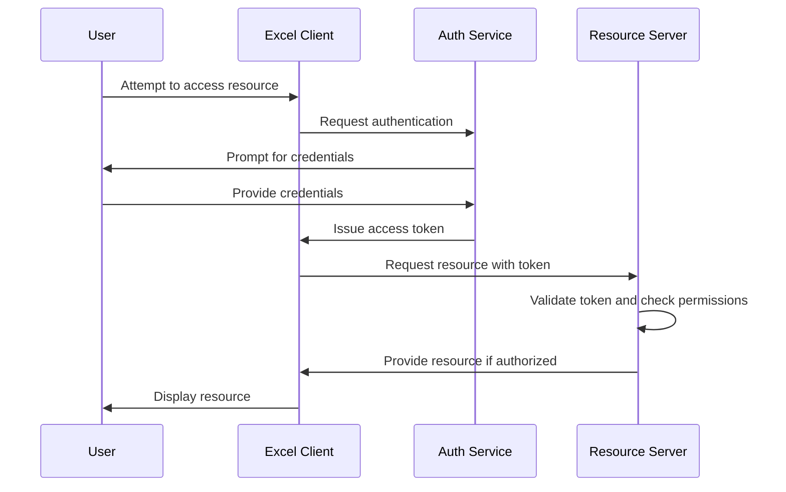

## DATA SECURITY

Excel employs multiple layers of security to protect sensitive data:

### Encryption

1. Data at Rest
   - AES-256 encryption for local files
   - Azure Storage Service Encryption for cloud-stored files

2. Data in Transit
   - TLS 1.3 for all network communications

### Data Classification

Excel supports data classification to ensure appropriate handling of sensitive information:

| Classification Level | Description | Security Measures |
|----------------------|-------------|-------------------|
| Public | Non-sensitive data | Standard encryption |
| Internal | Organization-wide data | Access limited to authenticated users |
| Confidential | Sensitive business data | Restricted sharing, audit logging |
| Highly Confidential | Critical business data | Encryption at cell level, strict access controls |

### Data Loss Prevention (DLP)

- Integration with Microsoft Information Protection
- Automatic detection and protection of sensitive data types (e.g., credit card numbers, social security numbers)
- Policy-based controls for data sharing and exporting

### Audit Logging

- Comprehensive logging of all data access and modifications
- Integration with Security Information and Event Management (SIEM) systems
- Retention of logs for compliance and forensic purposes

## SECURITY PROTOCOLS

Excel adheres to industry-standard security protocols and best practices:

### Secure Development Lifecycle (SDL)

1. Threat Modeling
   - Regular security reviews and threat assessments
   - Continuous vulnerability scanning

2. Secure Coding Practices
   - Code review process with security checks
   - Static and dynamic code analysis

3. Security Testing
   - Regular penetration testing
   - Fuzz testing for input validation

### Patch Management

- Regular security updates and patches
- Automated update distribution for desktop and mobile clients
- Staged rollout process for critical updates

### Incident Response

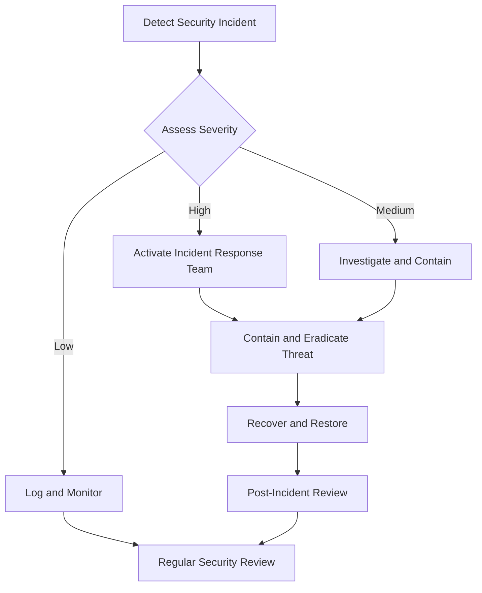

### Compliance

Excel maintains compliance with various security standards and regulations:

- SOC 2 Type II
- ISO 27001
- GDPR
- CCPA
- HIPAA (with appropriate configurations)

### Third-Party Security

- Rigorous security assessment for third-party integrations
- Regular security audits of cloud service providers
- Contractual security requirements for vendors and partners

### User Security Education

- In-app security guidance and tooltips
- Regular security awareness training for enterprise users
- Documentation on best practices for securing spreadsheets

By implementing these comprehensive security considerations, Microsoft Excel ensures the protection of user data and maintains a secure environment across all supported platforms, from individual users to enterprise-scale deployments.